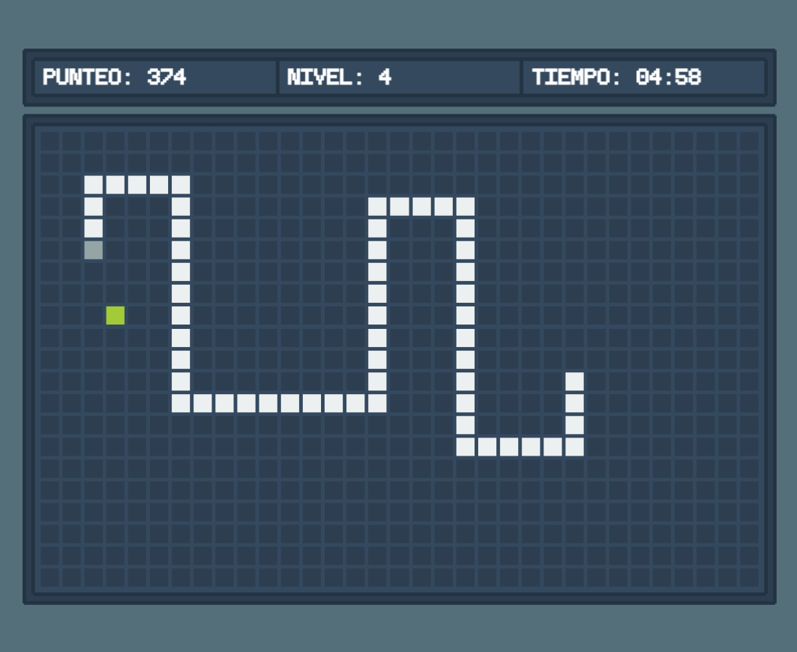

# JSnake

Version web del Snake, uno de los mas conocidos clasicos de los videojuegos. JSnake ha sido desarrollado con el framework Phaser y Typescript.

## Tecnologías usadas
### Frameworks y librerías

- [Phaser](https://phaser.io/)

### Automatizadores

- [Vite](https://vitejs.dev/)

### Fuentes

- [Pixeloid Mono](https://ggbot.itch.io/pixeloid-font)

## Getting started

1. `git clone https://github.com/HDMC3/jsnake.git`
2. `cd jsnake`
3. `npm install`
4. `npm run dev`